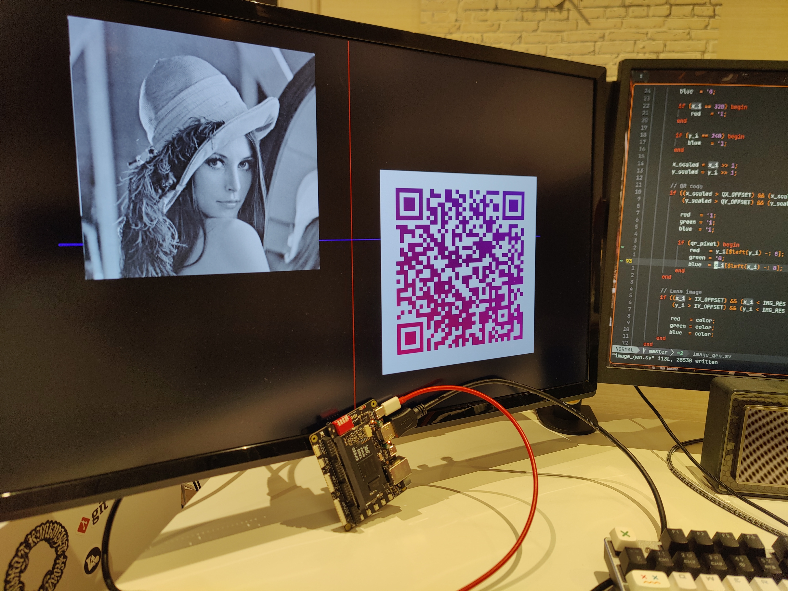

# Open DVI driver

I've done this project with a purpose to learn low-level implementation of DVI
protocol and stuff around it.

The idea was to make it vendor agnostic, portable and capable of running on open
source toolchain ([Yosys](https://github.com/YosysHQ/yosys)).
The only vendor specific black-boxes are PLL and `CLKDIV` for proper clocking.
They are in `board_top.sv` file and could be easialy avoided by adapting
`dvi_top.sv` module for your needs instead.

But if you happen to have Tang Primer 20K, then you can use `pins.cst` file
and `synth_n_load.sh` script to try this design.

## How to run on open source toolchain

You'll need Yosys and one of the supported FPGA Place and Route tools. For
Tang Primer 20K it is [Project Apicula](https://github.com/YosysHQ/apicula).

The easiest option to start with is to download everything in binary from
[OSS CAD SUITE](https://github.com/YosysHQ/oss-cad-suite-build).

You'll also need a tool to translate SystemVerilog packages to something that
Yosys understands, for example to Verilog 2005. You can use
[SV2V](https://github.com/zachjs/sv2v) for that.
